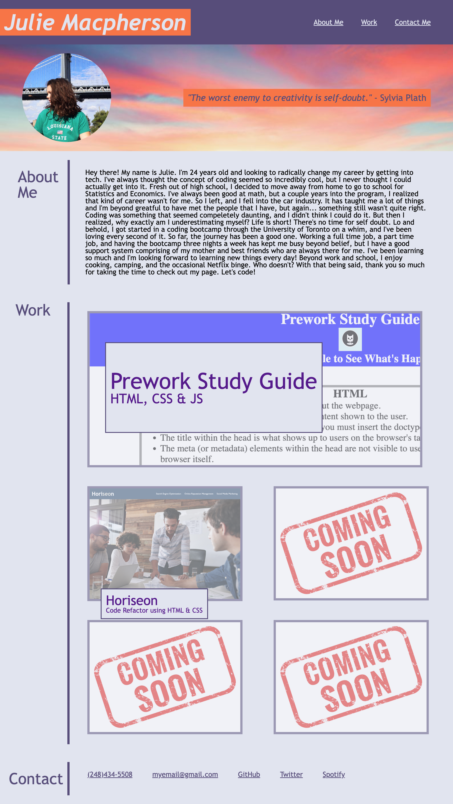

# My Portfolio

## Description

This project was to create a portfolio page to show to potential employers my previous work. It features my name, a photo of myself, an about me section, my previous work, and ways to contact me.

## Installation

No installation required - [Click here](https://julie-mac.github.io/my-portfolio/) to view the deployed webpage

## Usage

To navigate the webpage, refer to the navigation bar at the top of the page. There you will find links that take you to different sections of the page, including the About Me, Work, and Contact Information. Included in the Work section, you will find photo links that take you to deployed webpages. In the Contact section, you will find links on how to contact me.

## Credits

[julie-mac](https://github.com/julie-mac)
[Meyer Web](https://meyerweb.com/eric/tools/css/reset/) - Provided CSS reset style sheet

## License

Please refer to the LICENSE in the repository.